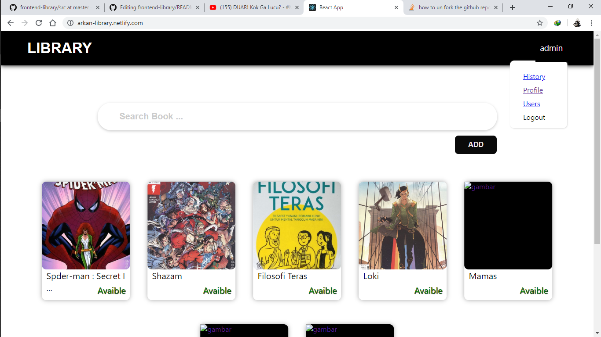

<h1 align='center'>CRUD with ReactJs + Redux with Restfull API (NodeJs + Express)</h1>

          

Simple Library (Lib App)

## Table of Contents

- [Introduction](#introduction)
- [Features](#features)
- [Requirements](#requirements)
- [Usage](#usage-for-development)
- [Screenshots](#screenshots)
- [License](#License)

## Introduction
This App help you find your favorite book and rent it, you can register and login as member

## Features
* Donate Book
* Borrow Book
* Add Book
* Detail Book

## Requirements
* [`npm`](https://www.npmjs.com/get-npm)
* [`Library Android Aplication`](https://github.com/Arizal-Arkan/React-Native-Library)
* [`Libarary App RESTful API`](https://github.com/Arizal-Arkan/backend-library)

## Usage for development
1. Open your terminal or command prompt
2. Type `git clone https://github.com/Arizal-Arkan/frontend-library.git`
3. Open the folder and type `npm install` for install dependencies
4. Before run this, you must setting configure on a backend 
5. Type `npm start` for run this app.

## Screenshots

        
        

## License
Arizal Arkan
* [`Demo`](https://arkan-library.netlify.com/)
